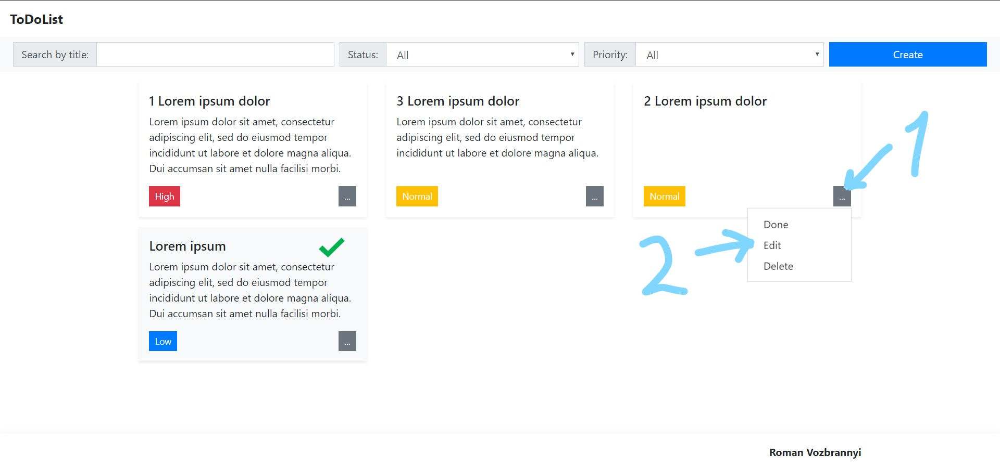
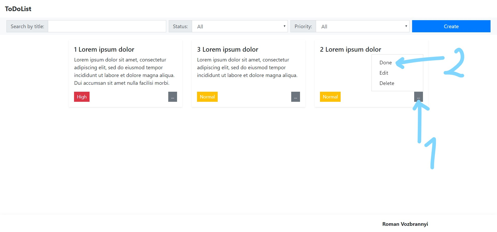
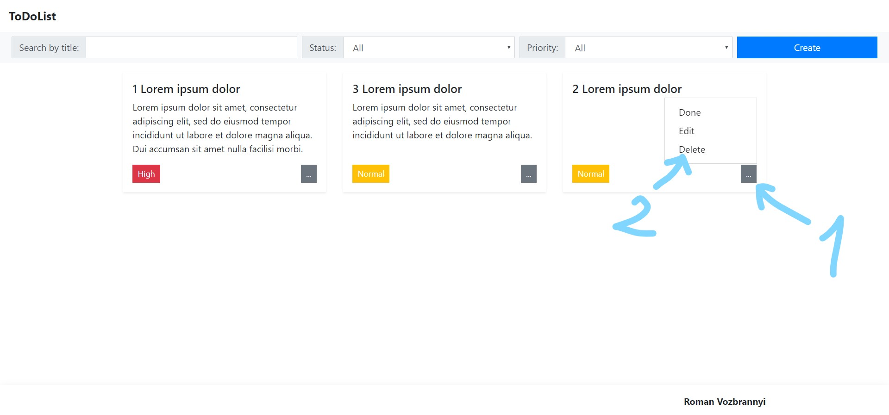
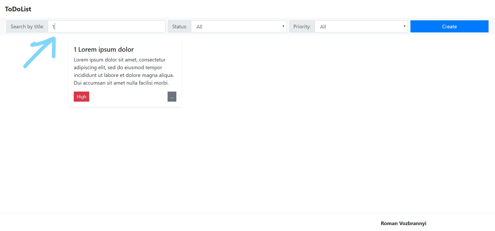

# ToDoList

Simple todo-list.

## Usage

### Display tasks

All user tasks displayed in the center of the window.
Tasks are sorted by priority and status.

---
### Create task

You need to click "Create" button on the top right to open modal.

1) Required field "Title" (max length = 20).
2) Optional field "Description".
3) Required field "Priority" (select from dropdown).
4) Click "Save" button to save task to localstorage.

Invalid input example.

---
### Edit task

1. To edit task you need to click "..." on the task.
2. Click "Edit" in the dropdown menu to open "Edit modal".

'Edit modal' is the same as "Add modal" but filled with data of selected task.

You can edit only undone tasks.

---
### Change task status

1. To change task you need to click "..." on the task.
2. Click "Done" / "Undone" in the dropdown menu.

---
### Delete task

1. To delete task you need to click "..." on the task.
2. Click "Delete" in the dropdown.

---
### Search by title

Input search value in the field to search by title.

---
### Filter by status

Select status to filter.

---
### Filter by priority

Select priority to filter.

